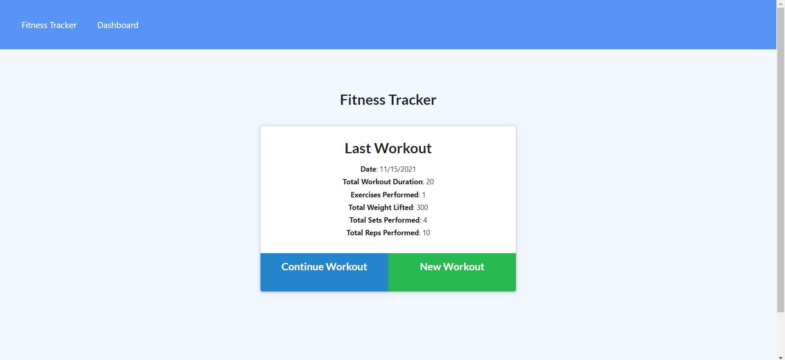
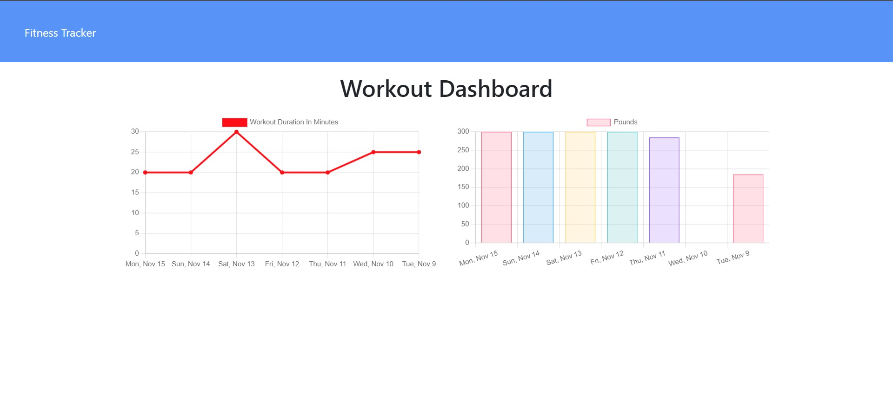

# Fitness tracker 

## Description
    
This app allows to track you workout. 

## Table of content
* [Description](#description)
* [Instalation](#installation)
* [Usage Information](#usage-information)
* [Questions](#questions)

## Installation

To run this project, install it locally using npm:
```
npm i
```

Also is needed to have installed MongoDB.

## Usage Information

Heroku deployed app: [Fitness Tracker](https://fitness-tracker262.herokuapp.com/)





## Questions
    
[Juan Jose Ramirez Github profile](https://github.com/JuanjoRamirez262)

email: juanjoramirezps@gmail.com

